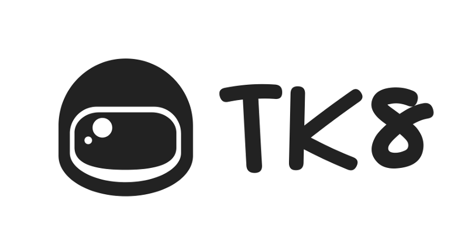

# tk8 (The Kubernaut): A multi-cloud, multi-cluster Kubernetes (k8s) platform installation and integration tool

tk8 is a CLI written in Golang to deploy Kubernetes using terraform and kubespray and also to install additional addons such as jmeter for loadtesting on k8s.
This version supports the k8s installation on AWS. GCP, OpenStack and Bare-Metall support are coming soon.

## TL;DR

git clone https://github.com/kubernauts/tk8.git

docker build -t tk8 ./tk8/.

vi ./tk8/config.yaml

--> pls. provide the aws access and secret keys, your ssh keypair name and your desired aws region

Note: create a key pair in aws with your public key (id_rsa.pub)

docker run -it -d -v "$(pwd)"/tk8:/tk8 tk8

alias dl='docker ps -l -q'

docker exec -it $(dl) bash

vi .ssh/id_rsa --> paste yor private key in id_rsa in the container

chmod 400 .ssh/id_rsa

tk8 cluster init ### kubespray will be cloned

tk8 cluster aws -c ### terraform brings up 2 bastion hosts and the master and worker nodes as specified in config.yaml, wail till the hosts are initialized

tk8 cluster aws -i ### kubespray installs kubernetes

tk8 cluster aws -d ### deytroy the cluster

Note: to get the kube config you need to ssh into the master from one of the bastion hosts 

ssh -i ~/.ssh/id_rsa core@"public ip of the bastion host"

copy the id_rsa to the bastion host and ssh into the master over the private ip address of the master, you'll find it under /etc/kubernetes/admin.conf

tk8 addon -l ### installs jmeter on top of your new cluster

