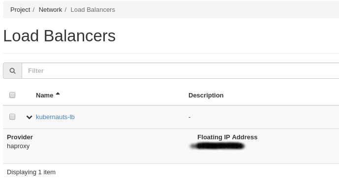

# TK8: A multi-cloud, multi-cluster Kubernetes platform installation and integration tool

tk8 is a CLI written in Golang to deploy Kubernetes using Terraform and Kubespray and also to install additional addons such as jmeter for loadtesting on k8s. This version supports the k8s installation on AWS and OpenStack.

Note: GCP, OpenStack and Bare-Metall support are coming soon.

## Kubernetes Deployment with TK8 on AWS

Afrer cloning the repo you'll build a dockeer image which contains Terraform and Ansible and the tk8 binary for linux.

If you're on mac, you'be to build tk8 with "go build ."

git clone https://github.com/kubernauts/tk8.git

docker build -t tk8 ./tk8/.

vi ./tk8/config.yaml

--> pls. provide the aws access and secret keys, your ssh keypair name and your desired aws region

Note: create a key pair in aws with your public key (id_rsa.pub)

docker run -it -d -v "$(pwd)"/tk8:/tk8 tk8

alias dl='docker ps -l -q'

docker exec -it $(dl) bash

vi /root/.ssh/id_rsa --> paste yor private key in id_rsa in the container

chmod 400 /root/.ssh/id_rsa

tk8 cluster init

--> kubespray will be cloned

tk8 cluster aws -c

--> terraform brings up 2 bastion hosts and the master and worker nodes as specified in config.yaml, please wait till the hosts are initialized

tk8 cluster aws -i

--> kubespray installs kubernetes

tk8 cluster aws -d

--> destroy the cluster

Note: to get the kube config you need to ssh into the master from one of the bastion hosts 

ssh -i ~/.ssh/id_rsa core@"public ip of the bastion host"

copy the id_rsa to the bastion host and ssh into the master over the private ip address of the master, you'll find it under /etc/kubernetes/admin.conf

tk8 addon -l

--> installs jmeter on top of your new cluster

tk8 -h

--> provides the help

## Kubernetes Deployment with TK8 on OpenStack

### Step 1:

Clone the TK8 repo and initialize the kubespray repo also if it has not been done yet

git clone https://github.com/kubernauts/tk8

    cd tk8/

    ./tk8 cluster init

### Step 2:

Adjust the following openstack files with your specific settings:

~/tk8/openstack/cluster.tfvars -- This file contains the parameters for the cloud components to be deployed e.g flavor, image, cluster_name, external network id (float network), number of masters, number etcd nodes, number of worker nodes etc. Some values have been set but some needs to be modified to suit your environment like the image, flavor (this is the ID not name) and external network id.

The elb_api_fqdn domain name should be set to a value that you can resolve within your network/deployment, this will should be resolvable to the load balancer VIP address of the master nodes i.e. Floating IP address (you can check the load balancer on Horizon or openstack CLI to check the value of the Load Balancer floating IP address for the master nodes). Snapshot is given below:

N.B -- Currently you can only use Centos 7 image (image can be downloaded from the centos public repo), Ubuntu and Coreos will be added soon.

Also make sure you use the right set of SSH keys, you are to use the SSH public key that you used to create the key pair on Openstack, otherwise the kubernetes installation will not be able to access the VMs via ssh.

~/tk8/openstack/stack_credentials.yaml  -- This file contains your openstack credentials, modify as per your openstack deployment.

### Step 3:

Create the infrastructure with the following command:

	./tk8 cluster openstack -c

### Step 4:

Install kubernetes on the infrastructure that was created with the following command:

	./tk8 cluster openstack -i

### Step 5:

Destroy the infrastructure, use the following command:

	./tk8 cluster openstack -d

N.B -- Before destroying the cluster, make sure you delete any load balancer that was created inside your kubernetes cluster, otherwise, terraform destroy will not work completely since terraform did not create the additional load balancer (the load balancer is tied to some other aspects of the cloud which will affect the terraform destroy procedure).

